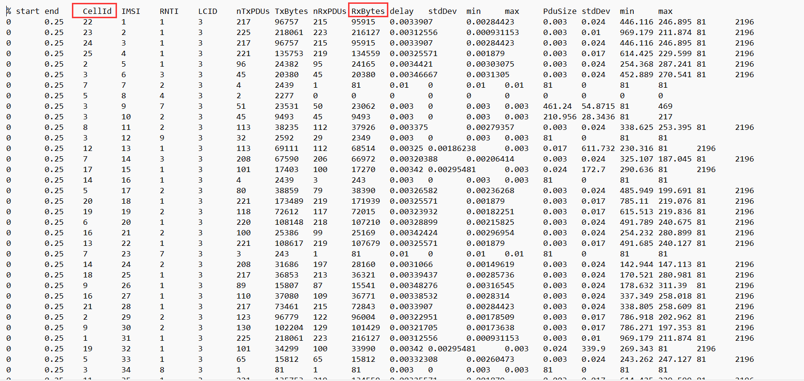
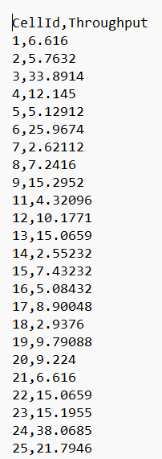
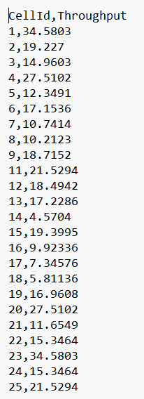
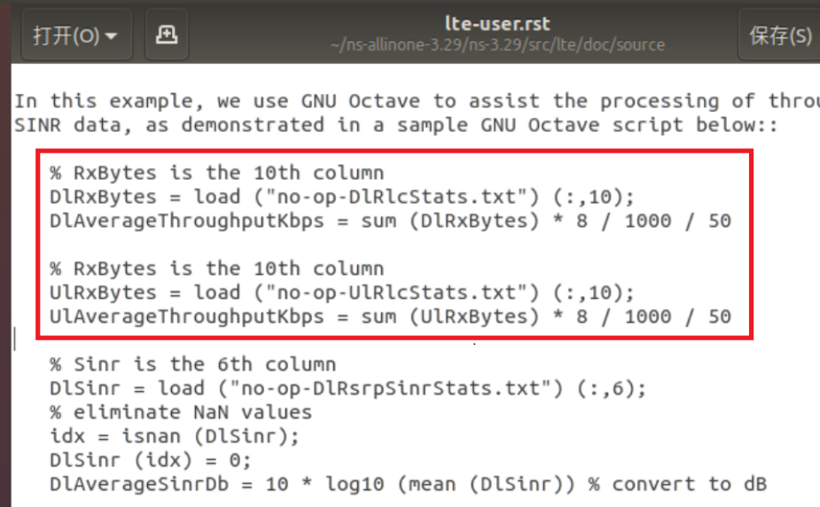
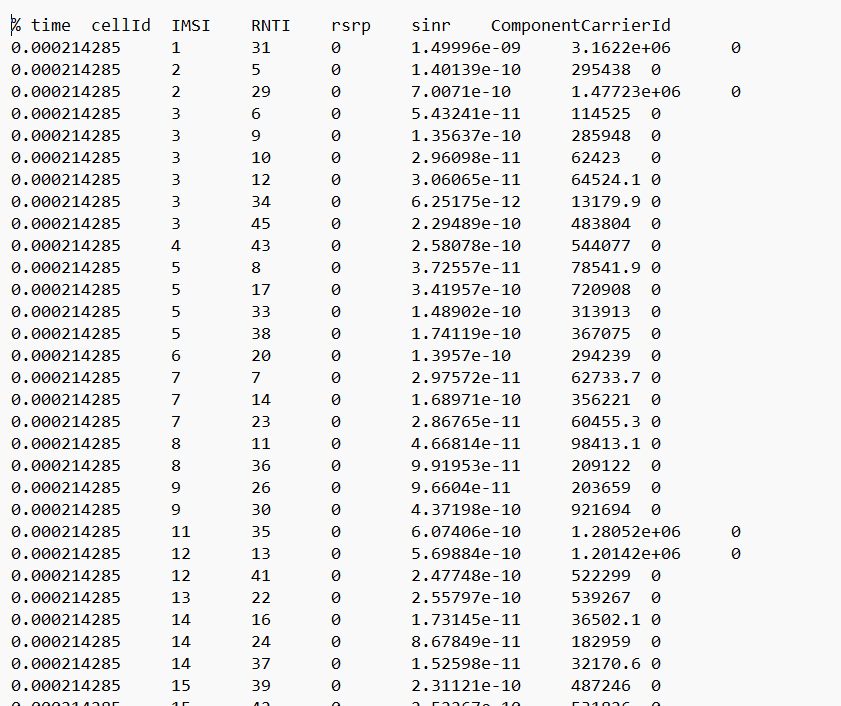
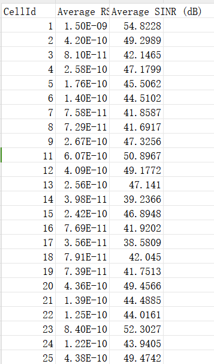
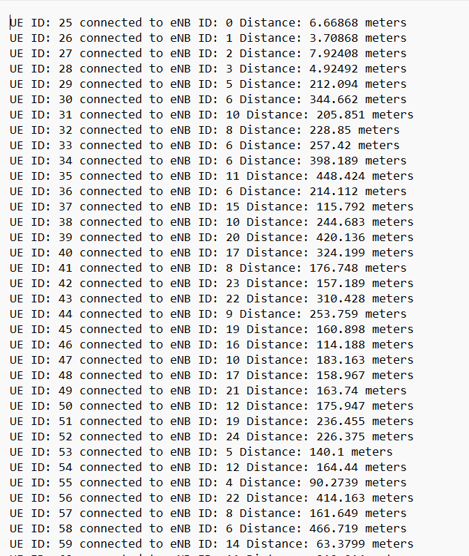

# NS3仿真之LTE数据分析RSRP，SINR，吞吐量

[toc]


## 1.运行脚本

首先在`lte.cc`代码中添加一行代码：

```c
lteHelper->EnablePhyTraces ();  //添加
lteHelper->EnableMacTraces ();
lteHelper->EnableRlcTraces ();
if (epc)
{
	lteHelper->EnablePdcpTraces ();
}
Simulator::Run ();

```

添加之后才能允许允许以下脚本的时候输出对应信息文件

```bash
./waf --run="scratch/lte --nMacroEnbSites=7 --nMacroEnbSitesX=2 --ns3::RadioBearerStatsCalculator::DlRlcOutputFilename=dlrdatastats.txt --ns3::RadioBearerStatsCalculator::UlRlcOutputFilename=ulrdatastats.txt  --ns3::PhyStatsCalculator::DlRsrpSinrFilename=dlrspsinr.txt --ns3::PhyStatsCalculator::UlSinrFilename=ulrsinr.txt"

```


## 2.计算吞吐量

`dlrdatastats.txt`和`ulrdatastats.txt`分别为上行链路（Uplink）和下行链路（Downlink）的RLC层统计数据，分别代表着从用户设备（UEs）到基站（eNBs）和从基站到用户设备的数据传输情况。

文件第三列为基站ID，第十列为接受的总字节数：




**我们在这里计算的是基站的吞吐量，吞吐量的计算数据是成功接受的数据，所以我们要以基站成功发送和成功接受的数据为准。所以要从两个文件的成功接受总字节数分别计算吞量和吐量。**


计算脚本为`cal_throughout.cpp`：

```c
#include <iostream>
#include <fstream>
#include <sstream>
#include <string>
#include <map>
#include <limits>

void calculateThroughput(const std::string& inputFileName, const std::string& outputFileName) {
    std::ifstream inFile(inputFileName);
    std::ofstream outFile(outputFileName);

    // 检查文件是否成功打开
    if (!inFile.is_open() || !outFile.is_open()) {
        std::cerr << "无法打开文件" << std::endl;
        return;
    }

    std::string line;
    std::map<int, double> throughputMap;
    getline(inFile, line); // 跳过第一行（标题行）

    // 读取每一行
    while (getline(inFile, line)) {
        std::stringstream ss(line);
        std::string cellIdStr, rxBytesStr;
        int cellId;
        double rxBytes;

        // 获取第三列（CellId）和第十列（RxBytes）
        for (int i = 0; i < 10; ++i) {
            if (i == 2) {
                getline(ss, cellIdStr, '\t');
            } else if (i == 9) {
                getline(ss, rxBytesStr, '\t');
            } else {
                ss.ignore(std::numeric_limits<std::streamsize>::max(), '\t');
            }
        }

        // 转换字符串为整数和浮点数
        std::stringstream(cellIdStr) >> cellId;
        std::stringstream(rxBytesStr) >> rxBytes;

        // 计算吞吐量并累加
        throughputMap[cellId] += (rxBytes * 8 / 1000 / 50);
    }

    // 输出结果到文件
    outFile << "CellId,Throughput\n";
    for (const auto& pair : throughputMap) {
        outFile << pair.first << "," << pair.second << std::endl;
    }

    inFile.close();
    outFile.close();
}

int main() {
    std::string inputFileName = "dlrdatastats.txt";
    std::string outputFileName = "tun.txt";
    calculateThroughput(inputFileName, outputFileName);
    
    inputFileName = "ulrdatastats.txt";
    outputFileName = "tu.txt";
    calculateThroughput(inputFileName, outputFileName);

    return 0;
}

```

最后会生成两个文件，`tun.txt`代表每个基站的吞量，`tu.txt`代表每个基站的突量：、

tu.txt:



tun.txt



可以看到吞量大于吐量，因为用户产生的数据肯定要比基站产生的数据多。


至于为什么吞吐量计算公式为：

```c
  throughputMap[cellId] += (rxBytes * 8 / 1000 / 50);
```

首先是byte是8个bit，单位为kbps，所以要/1000，但为什么是50s，是因为我们使用的初始脚本的文档中说明了这个脚本模拟的lte网络运行50s，所以要除50来计算：




## 3.计算RSRP，SINR

计算这两个数值主要使用了`dlrspsinr.txt`文件，用于记录下行链路（从基站到移动设备）的 RSRP 和 SINR 数据。

- **RSRP（参考信号接收功率）**：这是在移动通信中测量的一种信号强度指标，指的是在特定时间和空间中某个接收点的LTE参考信号的平均功率。RSRP 是衡量小区覆盖范围的重要指标。
- **SINR（信号与干扰加噪声比）**：这是信号质量的一个度量，表示有用信号与干扰信号加背景噪声之和的比值。在无线通信中，SINR 是评估信号质量和数据传输速率的关键参数。

文本内容为：



第二列为基站ID，第五第六列分别为RSRP和SINR值。


计算脚本为`call_other.cpp`:

```c
#include <iostream>
#include <fstream>
#include <sstream>
#include <string>
#include <map>
#include <cmath>

struct Stats {
    double totalRsrp = 0.0;
    double totalSinr = 0.0;
    int count = 0;
};

// 将 SINR 从线性刻度转换为分贝
double convertToDb(double sinr) {
    return 10 * log10(sinr);
}

int main() {
    std::ifstream inFile("dlrspsinr.txt");
    std::ofstream outFile("cellId_avg_stats.csv");

    if (!inFile.is_open()) {
        std::cerr << "无法打开输入文件" << std::endl;
        return 1;
    }

    if (!outFile.is_open()) {
        std::cerr << "无法打开输出文件" << std::endl;
        return 1;
    }

    std::string line;
    std::map<int, Stats> dataMap;

    // 跳过第一行标题
    std::getline(inFile, line);

    // 读取数据
    while (std::getline(inFile, line)) {
        std::stringstream ss(line);
        int cellId;
        double rsrp, sinr;

        // 读取列：time, cellId, IMSI, RNTI, rsrp, sinr, ComponentCarrierId
        ss >> line >> cellId >> line >> line >> rsrp >> sinr >> line;

        // 累加 RSRP 和 SINR，以及计数
        dataMap[cellId].totalRsrp += rsrp;
        dataMap[cellId].totalSinr += sinr;
        dataMap[cellId].count++;
    }

    // 计算平均值并输出到文件
    outFile << "CellId,Average RSRP,Average SINR (dB)\n";
    for (const auto& pair : dataMap) {
        double avgRsrp = pair.second.totalRsrp / pair.second.count;
        double avgSinrDb = convertToDb(pair.second.totalSinr / pair.second.count);
        outFile << pair.first << "," << avgRsrp << "," << avgSinrDb << std::endl;
    }

    inFile.close();
    outFile.close();

    return 0;
}


```

对于每个基站节点计算其RSRP的平均值，计算SINR的均值并转换为dB，输出文本为`cellid_avg_stats.csv`:





## 4.计算用户到基站的距离

NS-3提供了获取节点位置的方法，并且你可以使用这些方法来计算UE和它所连接的eNB之间的距离。这通常涉及以下几个步骤：

1. **获取UE和eNB的位置**:
   - 使用`MobilityModel`类的实例来获取每个UE和eNB的位置。
2. **计算距离**:
   - 对于每个UE，找到它所连接的eNB，并计算它们之间的距离。
3. **记录或输出距离信息**:
   - 将这些距离信息写入文件或在控制台上输出。


代码实现：

```c
 Simulator::Run ();    //在模拟器运行后添加以下代码

  //GtkConfigStore config;
  //config.ConfigureAttributes ();
	
  std::ofstream distanceFile;
    distanceFile.open("distance-to-enb.txt");

    // 获取UE和eNB节点
	    NodeContainer ueNodes ;
    NodeContainer enbNodes ;
    ueNodes.Add(homeUes);
    ueNodes.Add(macroUes);
    enbNodes.Add(homeEnbs);
    enbNodes.Add(macroEnbs);


   for (NodeContainer::Iterator ue = ueNodes.Begin (); ue != ueNodes.End (); ++ue)
    {
        Ptr<Node> ueNode = (*ue);
        Ptr<MobilityModel> ueMobility = ueNode->GetObject<MobilityModel>();

        // 获取UE的连接eNB
        Ptr<LteUeNetDevice> ueLteDevice = ueNode->GetDevice(0)->GetObject<LteUeNetDevice>();
        if (ueLteDevice)
        {
            Ptr<LteEnbNetDevice> connectedEnb = ueLteDevice->GetTargetEnb();

            // 获取eNB的位置
            for (NodeContainer::Iterator enb = enbNodes.Begin (); enb != enbNodes.End (); ++enb)
            {
                Ptr<Node> enbNode = (*enb);
                if (enbNode->GetDevice(0) == connectedEnb)
                {
                    Ptr<MobilityModel> enbMobility = enbNode->GetObject<MobilityModel>();
                    double distance = ueMobility->GetDistanceFrom(enbMobility);

                    // 将距离信息写入文件
                    distanceFile << "UE ID: " << ueNode->GetId() << " connected to eNB ID: " << enbNode->GetId() << " Distance: " << distance << " meters" << std::endl;
                    break;
                }
            }
        }
    }
```

输出文件为`distance-to-enb.txt`：

